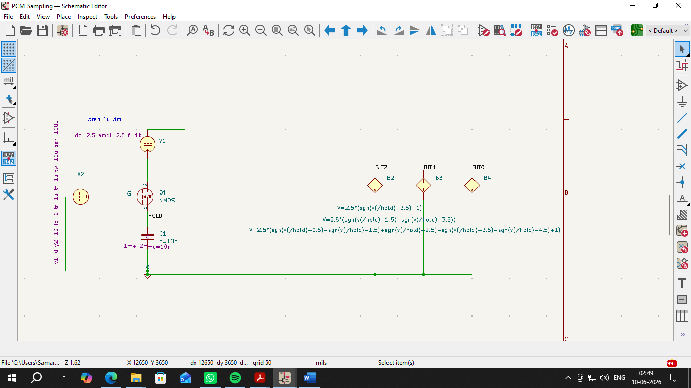
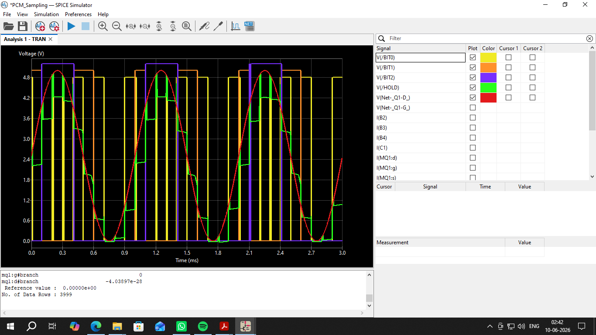

<div align="center">

# Pulse Code Modulation (PCM) Pipeline: KiCad Simulation

### Modeling analog-to-digital conversion through sampling, quantization, and 3-bit encoding

[](https://github.com/satvikpandurangi/Pulse-Code-Modulation-Simulation-kicad)
[](https://www.kicad.org/)
[](https://ngspice.sourceforge.io/)

</div>

---

## 📖 Overview

This repository contains a complete KiCad SPICE simulation of a Pulse Code Modulation (PCM) pipeline. It demonstrates the full analog-to-digital conversion process — continuous-time **Sampling**, voltage **Quantization**, and 3-bit **Digital Encoding** — using KiCad's integrated `ngspice` engine to verify each stage through transient analysis.

## 🎯 Objectives

- Design and simulate a Sample & Hold circuit using a MOSFET as a high-speed switch
- Model voltage quantization and 3-bit digital encoding using SPICE behavioral sources
- Verify the complete PCM pipeline against a continuous analog input signal

## ✨ Features

- MOSFET-based Sample & Hold (S/H) stage driven by a high-frequency clock
- Behavioral SPICE voltage sources (`B_V`) implementing quantization and encoding logic
- 3-bit digital output (MSB, Bit 1, LSB) derived from a sine wave input
- Staggered bit-trace voltages for clear, distinguishable waveform visualization

## ⚙️ Circuit Overview

The pipeline is built in three sequential stages:

- **Sampling:** An N-Channel MOSFET acts as a Sample & Hold switch, capturing the instantaneous analog voltage and holding it across a capacitor.
- **Quantization:** The held voltage is mapped to the nearest discrete level, producing a "staircase" approximation of the original waveform.
- **Encoding:** The quantized levels are converted into a 3-bit binary stream — MSB (Bit 2), Bit 1, and LSB (Bit 0) — using SPICE behavioral sources with `sgn()` math functions.

## 🧩 Components Used

| Type | Component | Value / Rating |
|------|-----------|-----------------|
| Active | N-Channel MOSFET (Sampling Switch) | — |
| Passive | Capacitor (Holding Element) | 10 nF |
| Mathematical | SPICE Behavioral Voltage Sources (B_V) | Quantization & encoding logic |
| Source | Sine Wave Voltage Source (Analog Input) | 1 kHz, 2.5 V offset, 2.5 V amplitude |
| Source | Pulse Voltage Source (Sampling Clock) | 10 kHz, 10 V amplitude, 10 µs pulse width |

## 🛠️ Software & Simulation

Built and simulated entirely in **KiCad EDA**, using its core subsystems:

- **Schematic Editor** — for laying out the MOSFET, capacitor, behavioral sources, and routing the circuit nets
- **Integrated SPICE Simulator (ngspice)** — translates the schematic into a netlist and runs the configured Transient Analysis to plot the input, sampled, and encoded waveforms

**Requirements:** KiCad (v6.0+ recommended) with the integrated `ngspice` simulator (included by default).

## 📂 Repository Structure

```
Pulse-Code-Modulation-Simulation-kicad
├── PCM.kicad_pro       # Main KiCad project file
├── PCM.kicad_sch       # Schematic and SPICE directives
├── PCM.kicad_pcb       # PCB layout file
├── PCM_Schematic.png   # Circuit schematic
├── PCM_Output.png      # Simulation waveform output
└── README.md
```

## 🚀 How to Open & Run

1. Clone the repository:
   ```bash
   git clone https://github.com/satvikpandurangi/Pulse-Code-Modulation-Simulation-kicad.git
   ```
2. Open `PCM.kicad_pro` in the KiCad Project Manager.
3. Open the Schematic Editor to view the circuit layout.
4. Go to **Inspect > Simulator** and click **Run/Stop Simulation**.
5. Probe the analog input, `/HOLD`, and the `/BIT2`, `/BIT1`, `/BIT0` nets to observe the conversion stages.

## 📊 Simulation Results

| Signal | Trace Color | Description |
|--------|-------------|--------------|
| Analog Input | Red | Continuous 1 kHz sine wave between 0 V and 5.0 V |
| Sampled Signal (`/HOLD`) | Green | Staircase pattern tracking the input during each clock pulse |
| Bit 0 / LSB (`/BIT0`) | Yellow (peak 4.8 V) | Square wave from the lowest quantization thresholds |
| Bit 1 (`/BIT1`) | Orange (peak 5.0 V) | Square wave from the mid-level quantization thresholds |
| Bit 2 / MSB (`/BIT2`) | Purple (peak 5.2 V) | HIGH for the upper half of the sine wave, LOW for the lower half |

The simulation confirms the full PCM pipeline operating correctly — the analog input is sampled, held, quantized, and encoded into a 3-bit digital representation that accurately tracks the source waveform's amplitude.

## 📸 Screenshots

**Schematic:**




**Simulation Output:**



